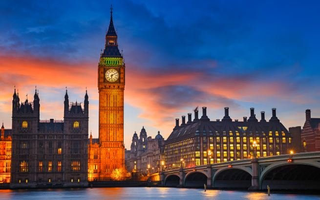
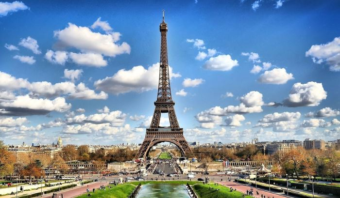
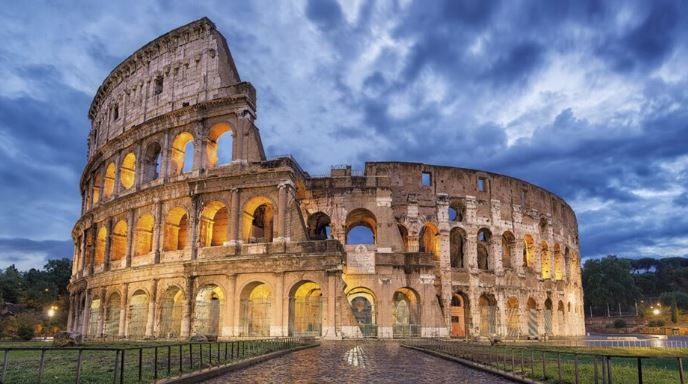
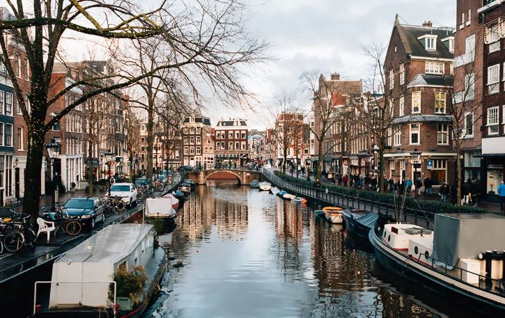

+++
date = '2024-12-10T23:57:56+01:00'
draft = false
title = 'Capitales'
+++

# Capitales del Mundo que He Visitado

## Londres  
La capital del Reino Unido es vibrante y multicultural. ¡Me fascinó!  
**Cosas que me encantaron:**
- La vista desde el **London Eye**.  
- El impresionante **Big Ben**.  
- La rica historia en la **Torre de Londres**.  

### Mapa de Londres (shortcode)



---

## París  
La ciudad del amor y la luz. París tiene un encanto único que me dejó sin palabras.  
**Cosas que más disfruté:**
- La **Torre Eiffel**, especialmente de noche.  
- Los paseos por el **Sena**.  
- La magnífica arquitectura del **Museo del Louvre**.  

### Mapa de Paris (shortcode)



---

## Roma  
La ciudad eterna es un museo al aire libre. Cada rincón tiene historia.  
**Aspectos destacados:**
- La majestuosidad del **Coliseo**.  
- La belleza de la **Fontana di Trevi**.  
- Explorar el **Vaticano**.  

### Mapa de Roma (shortcode)



---

## Ámsterdam  
Ámsterdam tiene una atmósfera relajada y encantadora. Sus canales son inolvidables.  
**Lo que más me gustó:**
- Navegar por los **canales**.  
- Los preciosos campos de **tulipanes** cercanos.  
- Visitar la **Casa de Ana Frank**.  

### Mapa de Amsterdam (shortcode)



