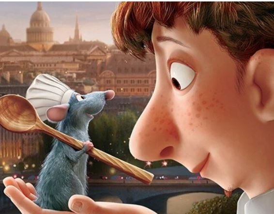
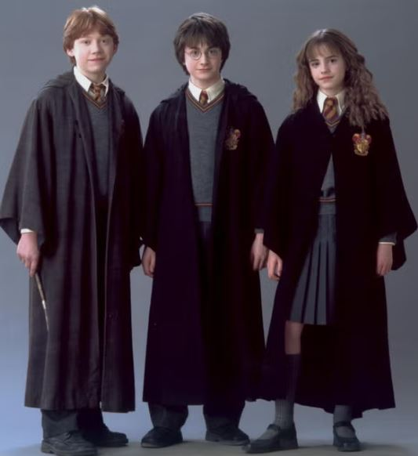
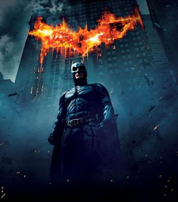
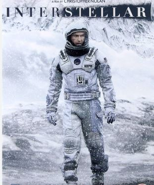

+++
date = '2024-12-10T23:57:48+01:00'
draft = false
title = 'Peliculas'
+++

# Mis Películas Favoritas

## Ratatouille  
Ratatouille es mi película de animación favorita. La historia de Remy, un ratón que sueña con ser chef, transmite mensajes profundos sobre perseguir nuestros sueños sin importar las barreras. Los detalles en la animación son increíbles, y la película siempre me inspira.  

#### Shortcodes Personalizados (Frases de la pelicula Ratatouille)

### Frases de Ratatouille:






---

## La Saga Harry Potter  
La saga de Harry Potter marcó mi infancia y, para mí, es la mejor saga de películas que existe. Incluso ahora, disfruto mucho volviendo a verla.  

---

## El Caballero Oscuro  
Esta película es una obra maestra. Desde el guion hasta los planos cinematográficos, cada detalle está cuidado. Heath Ledger como el Joker es impresionante, y toda la atmósfera de Gotham me atrapa por completo.  

---

## Interstellar  
Me apasiona el espacio y la ciencia, así que Interstellar es una de mis favoritas. El tratamiento de temas como la relatividad del tiempo en un contexto tan épico la hace una película increíble. Además, es del mismo director que El Caballero Oscuro, Cristopher Nolan. 

